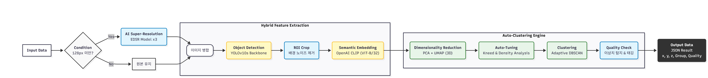

# 🖼️ AI Hybrid Image Clustering Engine
> **High-Performance Image Clustering Pipeline** combining Super Resolution, Object Detection, and Semantic Embedding.


## 📌 Introduction
This project is a data processing engine designed to semantically cluster large-scale **unstructured image data** and visualize it in 3D space.
Unlike traditional methods that simply extract global image features, we maximized clustering accuracy by building a **3-stage hybrid pipeline**: Super Resolution (SR) → Object Detection (YOLO) → Feature Extraction (CLIP).

## 🛠️ Architecture Pipeline
The engine processes data through the following 4 stages:



1.  **Adaptive Super Resolution (EDSR)**: Automatically detects low-resolution images (< 128px) and performs 3x upscaling.
2.  **Object-Centric Cropping (YOLOv10s)**: Removes unnecessary background noise and crops only the **main object** to improve feature extraction accuracy.
3.  **Semantic Embedding (CLIP ViT-B/32)**: Extracts 512-dimensional high-level feature vectors using the CLIP model, which has learned semantic associations between text and images.
4.  **Auto-Tuning Clustering (UMAP + DBSCAN)**:
    * **PCA & UMAP**: Dimensionality reduction to 3D (for visualization ease and noise reduction).
    * **Knee Locator**: Mathematically calculates the optimal `epsilon` value for DBSCAN to automate hyperparameter tuning.

## ✨ Key Features
* **🧩 Multi-Model Ensemble**: Combines the strengths of SOTA (State-of-the-Art) models like EDSR, YOLOv10, and CLIP.
* **🔍 Conditional Processing**: Ensures processing efficiency by concentrating computational resources only on small images (conditional upscaling) instead of processing the entire dataset.
* **🤖 Automated Tuning**: Includes an algorithm that dynamically adjusts clustering density (Eps) based on data distribution.
* **📊 Quality Assessment**: Automatically evaluates grouping quality (High/Low) by calculating the spread (cohesion) of data within a cluster.

## 💻 Tech Stack
* **Core**: Python, PyTorch, OpenCV
* **Models**: YOLOv10 (Ultralytics), CLIP (OpenAI), EDSR (Super Resolution)
* **ML/Math**: Scikit-learn (PCA, DBSCAN), UMAP, Kneed (Elbow point detection)

## 🚀 Usage

### 1. Installation
```
pip install -r requirements.txt
```

### 2. Run Engine
```
python cluster_engine.py --image_dir ./data/images --output ./results/clustering_result.json
```
--image_dir: Path to the directory containing images for clustering.

--output: Path to save the result JSON file.

## 📂 Output Structure (JSON)
The result file is saved in a format ready for immediate use in 3D visualization platforms (e.g., Three.js).
```

[
    {
        "filename": "data/images/player_01.jpg",
        "label": "player",
        "x": 3.421,
        "y": -1.205,
        "z": 5.112,
        "group": 1,
        "quality": "high"
    },
    ...
]
```
## 📜 License
MIT License
